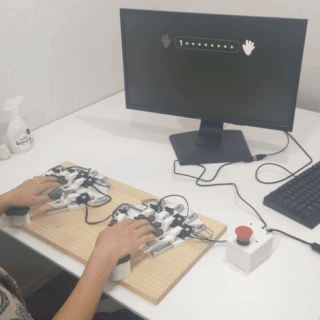
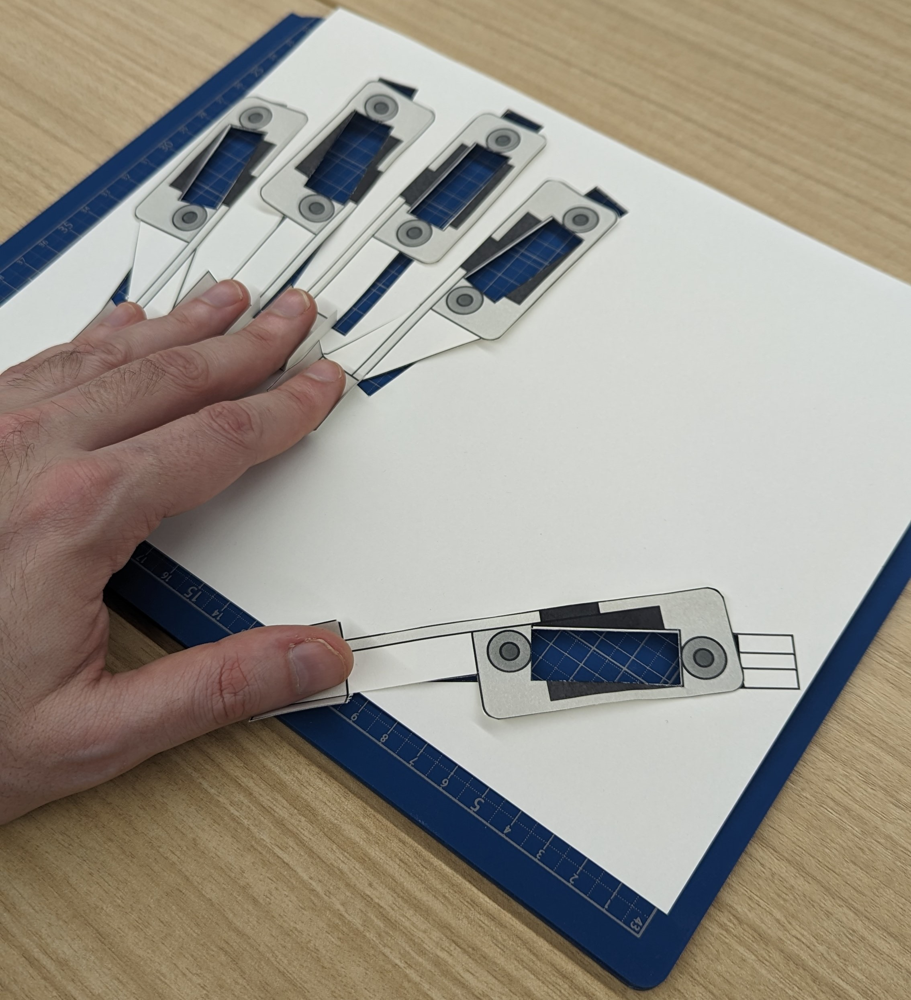
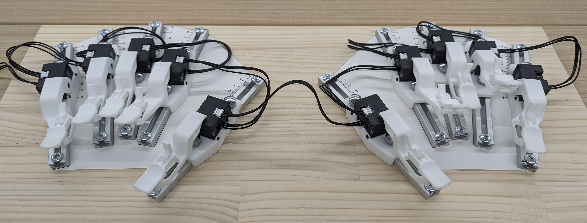
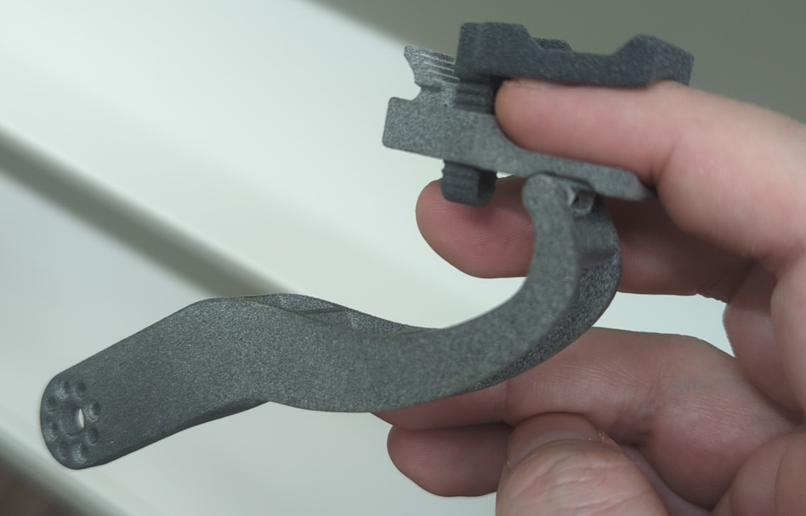
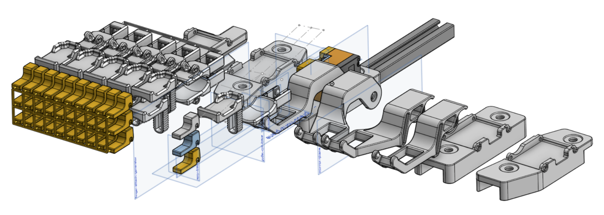
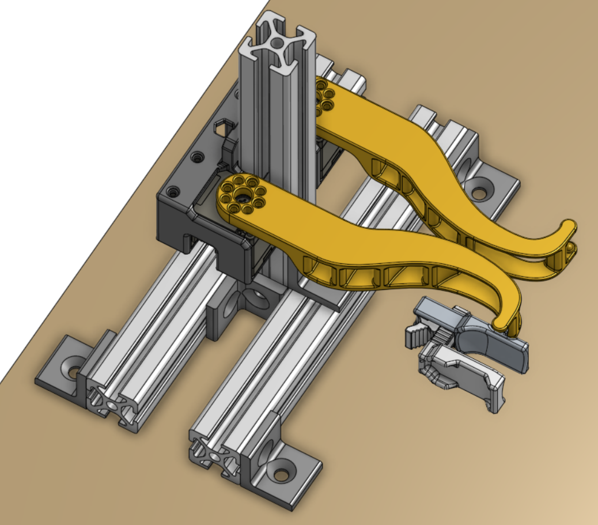
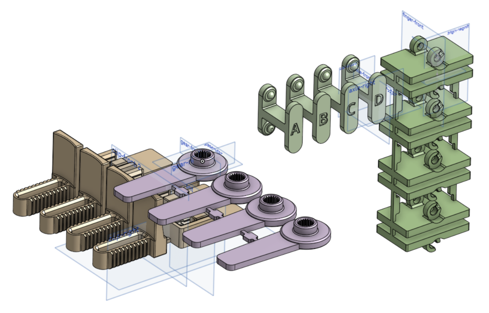
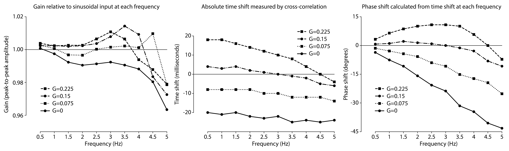
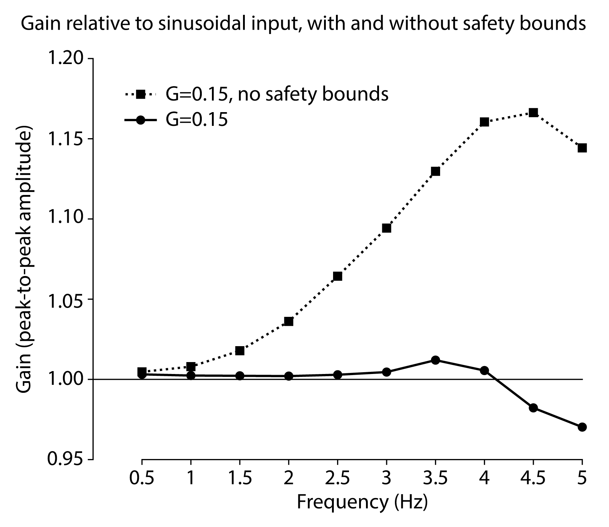
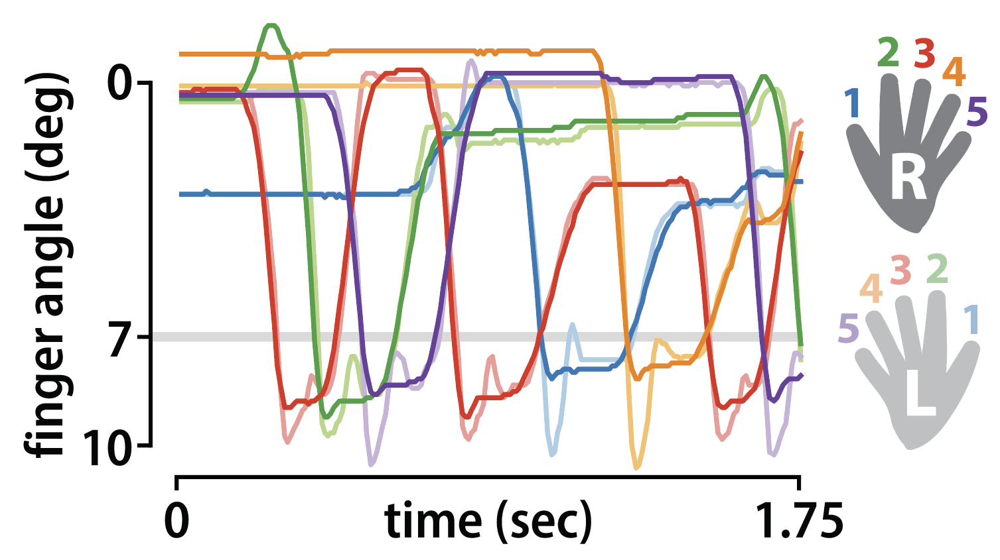

# Robotic Finger Interface

Project summary for a robotic finger interface used in sensorimotor neuroscience experiments.

## Demos

10-finger keyboard in action. Movements with the right hand can be instantaneously mirrored to the left hand:


The keyboard can be used in real-time tasks such as motor sequence learning. Here, the movement from one trial with the right hand is replayed on the next trial with the left hand:



Angled rail attachments allow for adjustment to any hand size:




<br />
<br />

Finger clips are adjustable to individual finger heights:




## System

### Motors

DYNAMIXEL servos ([XL330](https://www.robotis.us/dynamixel-xl330-m288-t/)) are controlled over USB ([U2D2](https://www.robotis.us/u2d2/)) and powered with a 5V power brick ([U2D2 PHB](https://www.robotis.us/u2d2-power-hub-board-set/) + [5V 50W AC/DC adapter](https://www.digikey.com/en/products/detail/adafruit-industries-llc/658/5774322)).

DYNAMIXEL was primarily chosen for its hybrid torque/position control mode ('current-based position control'), which is ideal for human-robot interaction. For example:
- instantaneously switching from active (self) movement to passive (robot) movement by adjusting the motor's current limit
- adjusting the motor's current limit to an intermediate value creates a 'virtual spring', allowing active (self) movement to feel natural, as if you are pressing real buttons

Other advantages of DYNAMIXEL:
- open-source and well-maintained [Python SDK](https://github.com/ROBOTIS-GIT/DynamixelSDK)
- easily scale number of motors by daisy-chaining (the common serial interface has similar performance from 1 to 10+ motors)
- same software interface for a wide range of motors (scalable for higher precision motors or more powerful ones, e.g. for future applications such as whole arm movements)

### Software

The robot operates asynchronously at 500Hz using Python's `multiprocessing` library. A wrapper object is provided for any desired frontend (for example, a [PsychoPy](https://www.psychopy.org/) experiment). This allows the frontend script to run at a lower frequency (e.g. at 60Hz or your monitor's refresh rate) while time-sensitive operations such as finger mirroring or high-frequency data recording occur in parallel.

Any Python script can be used to operate the robot. For example:
```
from keyboard import *

# start the keyboard process
kb = KeyboardWrapper('MyRobotConfig')

# set keyboard to mirror actions from right to left hand
kb.send_command('mode_action_mirror_rh')

# get the latest positions of all fingers
finger_positions = kb.all_pos[:]

# turn off motors and stop the keyboard process
kb.shutdown()
```

Or use it in a full PsychoPy experiment:
```
from psychopy import core, event, visual
from keyboard import *

class MyExperiment(object):
    def __init__(self):
        event.globalKeys.add(key='q', func=self.quit)
        self.running = True
        self.win = visual.Window()
        self.kb = KeyboardWrapper('MyRobotConfig')

    def run_main_loop(self):
        while self.running:
            # any experiment logic here!
            print(self.kb.all_pos[:])
            # ...
            self.win.flip()

    def quit(self):
        self.running = False
        self.kb.shutdown()
        core.quit()

if __name__ == '__main__':
    my_experiment = MyExperiment()
    my_experiment.run_main_loop()
```

Configuration of the robot is specified in `./config/MyRobotConfig.yml`. Use [Dynamixel Wizard](https://emanual.robotis.com/docs/en/software/dynamixel/dynamixel_wizard2/) software to initialize the ID and Baudrate for each motor. Common parameters such as PID gains or neutral angles for the virtual spring can also be found here.

*Ideally, the asynchronous operation of DYNAMIXEL motors will exist in a separate `async-dynamixel` library, with the application to sensorimotor neuroscience experiments as a separate project. For now, some care must be taken to ensure `config.yml` and `device.py` are compatible.*

### Mechanical

All parts are designed for 3D-printing with either [traditional SLS](https://jlc3dp.com/3d-printing/selective-laser-sintering) or [HP's multi-jet fusion (MJF)](https://jlc3dp.com/3d-printing/multi-jet-fusion). PA12 nylon (or similar) can be used for all parts, although I recommend glass-filled nylon for larger/structural parts if possible.

Snap and friction fits are used for all assembly, except (optionally) the attachment to the motor horn using 4 machine screws provided with the motor. For example, the current 10-finger layout requires removal of the default motor horn to reduce the overall width of the assembly, but a 2-finger device uses the standard screw attachment.

You can find the CAD files for 3D printing of the 10-finger keyboard [here](https://cad.onshape.com/documents/8b969b337e85e8f7ab19026b/w/66c87879a072b08b9962883d/e/ee24301693dca147d159b158).



I also made a 2-finger device (with some general design updates) [here](https://cad.onshape.com/documents/8b969b337e85e8f7ab19026b/w/66c87879a072b08b9962883d/e/238b0e304fd4029c7308b27a).



You can browse the various tabs within [the OnShape document](https://cad.onshape.com/documents/8b969b337e85e8f7ab19026b/w/66c87879a072b08b9962883d/e/238b0e304fd4029c7308b27a) to see my design process and iterations.

When first sourcing parts, I recommend a test run with the target printer+material with various tolerances to ensure good fits on the final prints [(here's a sample sizing sketch)](https://cad.onshape.com/documents/8b969b337e85e8f7ab19026b/w/66c87879a072b08b9962883d/e/41a75a309f798fbe14b59963):



## Performance

Operating frequency is limited by USB latency, which defaults to 16ms for most devices. USB latency should be [adjusted to 1ms](https://emanual.robotis.com/docs/en/software/dynamixel/dynamixel_wizard2/#usb-latency-setting) to guarantee 500Hz performance.

Using DYNAMIXEL SDK's `GroupSyncRead` with `FastSyncRead`, we can record multiple parameters (realtime tick, position, and velocity) at 500Hz from 10 motor simultaneously. Writing to motors with `GroupSyncWrite` operates at the same frequency.

For most applications, the SDK can be used 'as-is' to command motors to positions according to your experiment parameters. For continuous tracking of trajectories between 0-5Hz, you can expect a delay of less than 25ms (see below plots, middle panel, `G=0`).

For my specific experimental application, I was interested in further minimizing this delay, especially for higher frequency movements. I implemented a predictive gain `G` for movements based on their velocity, with a 'safety bound' based on the expected range of motion. The results from a sine sweep experiment are shown below:



Gain is well-controlled by the safety bounds (left panel). The absolute time shift (middle panel) is relatively stable across frequencies, with too high of `G` resulting in a 'leading' behavior, while the expected 'lagging' behavior is shown with `G=0` ('only' 20-25ms across the frequency range). While 25ms seems small, we can see that this corresponds to nearly a 45 degree phase shift at 5Hz (right panel) - for fast hand movements, this delay is easily noticed by participants during experiments.

We can also remove the safety bounds to examine the inherent overshoot of predictive gain:



When using predictive gain, it is important to include the safety bounds (i.e. the minimum and maximum expected positions of the fingers) to avoid awkward movements or bottoming out too hard against any physical stops. Even with the inherent overshoot, physical mirroring feels synchronous with predictive gain, and asynchrony can be sensed by users of the device during fast movements if the predictive gain is disabled.

Finally, here is sample data from an experiment where movements of the right hand were mirrored to the left hand (safety bounds: 0-10 degrees; press detected at 7 degrees). A 9-press sequence was executed in under 2 seconds, roughly corresponding to a 5Hz movement:



*In addition to the expected overshooting behavior, we also see an unexpected undershoot after each press. Here, the predictive gain was calculated from the DYNAMIXEL's reported velocity, which uses a 50ms moving average filter internally, causing a delayed undershoot response. Future work will implement a new velocity estimator to reduce this undesired undershoot.*

